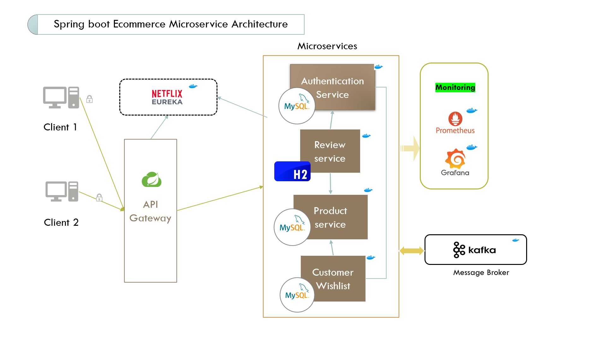

### E-commerce Microservices (Spring Boot)

This repository implements an e-commerce platform using a microservices architecture in Spring Boot. It separates concerns across multiple services (Product, Review, Customer, Authentication, API Gateway, Discovery), improving modularity, scalability, and team autonomy.

#### Architecture



Services register with Eureka and are routed via the API Gateway. Each service owns its domain data and exposes REST APIs. Security is enforced at the edge and/or per service using JWT.

---

### Modules
- `eureka-server`: Service discovery registry
- `api-gateway`: Single entry point; routes external requests to backend services
- `authentication`: Auth service for issuing/validating JWT tokens
- `product-service`: Catalog, product CRUD, search
- `review-service`: Product reviews and ratings
- `customer-service`: Customer profile, addresses, and related operations
- `admin-client`/`app`: UI clients (if used in your setup)

---

### Prerequisites
- JDK 17+
- Maven 3.9+
- Docker & Docker Compose (for infra and containerized run)

---

### Run Locally (Quick Start)

Option A: All services via Maven (recommended for development)
```
cd eureka-server && ./mvnw spring-boot:run
cd ../api-gateway && ./mvnw spring-boot:run
cd ../authentication && ./mvnw spring-boot:run
cd ../product-service && ./mvnw spring-boot:run
cd ../review-service && ./mvnw spring-boot:run
cd ../customer-service && ./mvnw spring-boot:run
```

Bring services up in this order to satisfy dependencies: Eureka → Gateway → Auth → others.

Option B: Using Docker Compose (if images or Dockerfiles are provided)
```
docker compose up -d
```

Stop services
```
docker compose down
```

---

### Configuration & Environment
- Application properties are service-local. Central config can be added later via Spring Cloud Config if needed.
- Environment variables (examples):
  - `JWT_SECRET`, `JWT_EXPIRY_MIN`
  - `DB_URL`, `DB_USERNAME`, `DB_PASSWORD`
  - `GATEWAY_PORT`, per-service `SERVER_PORT`

Set env vars in your shell, `.env`, or via Docker Compose `environment` entries.

---

### API Endpoints (Examples)

- Authentication
  - `POST /auth/login` → returns JWT
  - `POST /auth/register`

- Product Service
  - `GET /products`
  - `GET /products/{id}`
  - `POST /products` (secured)

- Review Service
  - `GET /reviews?productId={id}`
  - `POST /reviews` (secured)

- Customer Service
  - `GET /customers/me` (secured)
  - `PUT /customers/me` (secured)

Gateway routes external `/api/**` paths to the respective downstream services.

---

### Build & Test
Build all services
```
mvn -q -pl eureka-server,api-gateway,authentication,product-service,review-service,customer-service -am clean package
```

Run tests
```
mvn -q test
```

---

### Observability
- Add Spring Boot Actuator for health, metrics, and info endpoints.
- `prometheus.yml` is included; you can wire Prometheus and Grafana to visualize metrics.

---

### Security
- JWT-based authentication; ensure `JWT_SECRET` is strong in non-dev environments.
- Validate tokens at the gateway and/or inside each service.

---
